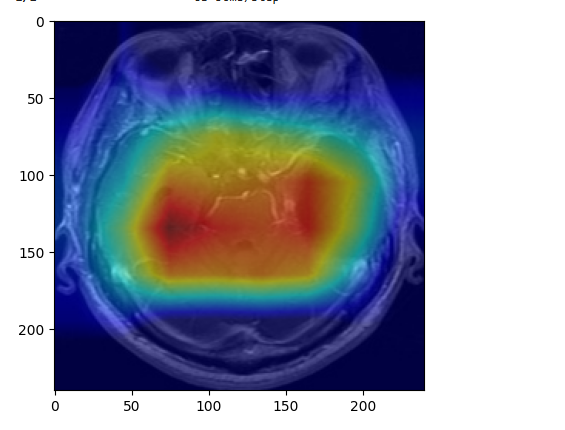
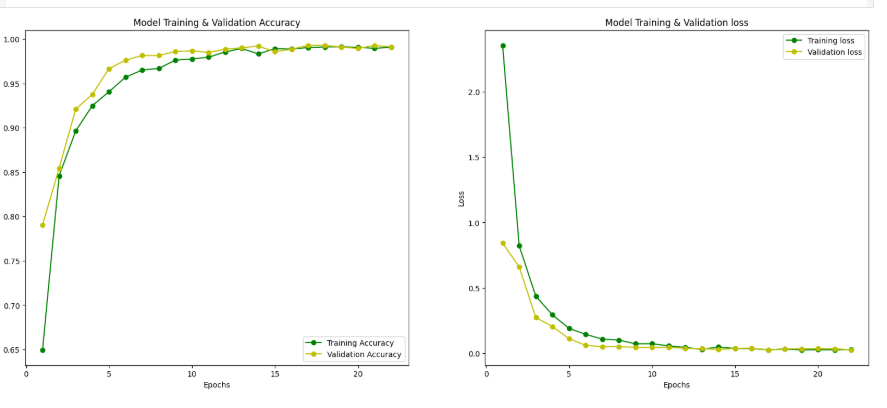

# Brain Tumor Classification Using Deep Learning & GradCAM

A deep learning project for classifying brain tumors from MRI images using EfficientNetB1 and visualizing model predictions with Gradient-weighted Class Activation Mapping (GradCAM).

## 📋 Overview

This project implements a brain tumor classification system that can identify four types of brain conditions from MRI scans:
- **Glioma** - A type of tumor that occurs in the brain and spinal cord
- **Meningioma** - A tumor that arises from the meninges
- **Pituitary** - Tumors that form in the pituitary gland
- **No Tumor** - Healthy brain scans with no tumor present

## 🎯 Features

- **Image Preprocessing**: Automatic brain region cropping using contour detection
- **Data Augmentation**: Rotation, horizontal flip, and height shift for improved generalization
- **Transfer Learning**: Utilizes EfficientNetB1 pretrained on ImageNet
- **Model Interpretability**: GradCAM visualization to understand model decisions
- **Comprehensive Evaluation**: Confusion matrix, classification report, and accuracy metrics

## 📊 Dataset

The project uses the [Brain Tumor MRI Dataset](https://www.kaggle.com/datasets/masoudnickparvar/brain-tumor-mri-dataset) from Kaggle, which contains MRI images organized into training and testing sets.

### Dataset Structure
```
Training/
├── glioma/
├── meningioma/
├── notumor/
└── pituitary/

Testing/
├── glioma/
├── meningioma/
├── notumor/
└── pituitary/
```

## 🛠️ Technologies Used

- **Python 3.x**
- **TensorFlow/Keras** - Deep learning framework
- **OpenCV** - Image processing
- **NumPy** - Numerical computations
- **Pandas** - Data manipulation
- **Matplotlib & Seaborn** - Data visualization
- **scikit-learn** - Evaluation metrics
- **imutils** - Image utilities

## 🚀 Installation

1. Clone the repository:
```bash
git clone https://github.com/yourusername/brain-tumor-classification.git
cd brain-tumor-classification
```

2. Install required packages:
```bash
pip install tensorflow opencv-python numpy pandas matplotlib seaborn scikit-learn imutils kagglehub tqdm pillow
```

3. Download the dataset:
```python
import kagglehub
path = kagglehub.dataset_download("masoudnickparvar/brain-tumor-mri-dataset")
```

## 📁 Project Structure

```
Brain Tumor Classification/
├── Brain_Tumor_Classification_Using_DL_&_GradCAM.ipynb  # Main notebook
├── README.md                                             # Project documentation
└── model.keras                                           # Saved model weights (after training)
```

## 🔄 Workflow

1. **Data Loading**: Download and organize the MRI dataset
2. **Preprocessing**: 
   - Crop brain regions using contour detection
   - Resize images to 240x240 pixels
3. **Data Augmentation**: Apply transformations to increase dataset diversity
4. **Model Architecture**:
   - EfficientNetB1 backbone (pretrained on ImageNet)
   - Global Max Pooling layer
   - Dropout layer (0.5)
   - Dense layer with softmax activation (4 classes)
5. **Training**: 
   - Optimizer: Adam (learning rate = 0.0001)
   - Loss: Categorical Crossentropy
   - Callbacks: ModelCheckpoint, EarlyStopping, ReduceLROnPlateau
6. **Evaluation**: Generate confusion matrix and classification report
7. **Visualization**: Use GradCAM to visualize model attention

## 🧠 Model Architecture

```
EfficientNetB1 (pretrained, frozen weights)
    ↓
GlobalMaxPooling2D
    ↓
Dropout (0.5)
    ↓
Dense (4 units, softmax)
```

## 📈 Training Configuration

| Parameter | Value |
|-----------|-------|
| Input Size | 240 × 240 × 3 |
| Batch Size | 32 |
| Learning Rate | 0.0001 |
| Epochs | 30 (with early stopping) |
| Validation Split | 20% |
| Optimizer | Adam |

## 🎨 GradCAM Visualization

GradCAM (Gradient-weighted Class Activation Mapping) is implemented to provide visual explanations of the model's predictions. It highlights the regions of the MRI scan that the model focuses on when making classification decisions, improving model interpretability and trustworthiness in medical applications.



The heatmap overlay shows the areas of the brain MRI that the model considers most important for its prediction, with red/yellow regions indicating high importance.

## 📊 Results

The model achieves an impressive **99.08% accuracy** on the test dataset.

### Training & Validation Curves



The plots show the model's training and validation accuracy/loss over ~22 epochs. The model converges quickly and maintains stable performance without significant overfitting.

### Classification Report

| Class | Precision | Recall | F1-Score | Support |
|-------|-----------|--------|----------|---------|
| Glioma | 0.99 | 0.98 | 0.98 | 300 |
| Meningioma | 0.97 | 0.98 | 0.98 | 306 |
| No Tumor | 1.00 | 1.00 | 1.00 | 405 |
| Pituitary | 0.99 | 0.99 | 0.99 | 300 |
| **Overall** | **0.99** | **0.99** | **0.99** | **1311** |

### Evaluation Metrics

The model is evaluated using:
- **Accuracy Score**: 99.08%
- **Confusion Matrix**
- **Classification Report** (Precision, Recall, F1-Score)

## 🤝 Contributing

Contributions are welcome! Please feel free to submit a Pull Request.

## 📄 License

This project is licensed under the MIT License - see the [LICENSE](LICENSE) file for details.

## 🙏 Acknowledgments

- [Masoud Nickparvar](https://www.kaggle.com/masoudnickparvar) for providing the Brain Tumor MRI Dataset
- TensorFlow/Keras team for the EfficientNet implementation
- The medical imaging community for advancing AI in healthcare

## ⚠️ Disclaimer

This project is for educational and research purposes only. It should not be used as a substitute for professional medical diagnosis. Always consult healthcare professionals for medical advice.